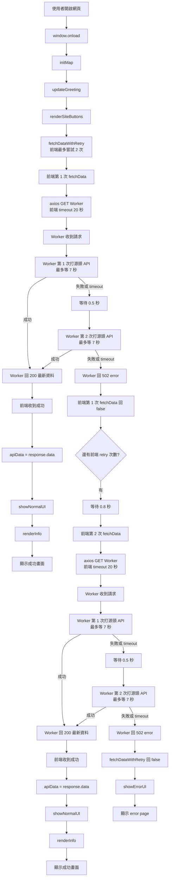

## 關鍵修改

太好了，Cloud Run 台灣區代理成功後，你現在的最佳策略應該是：

優先打 Cloudflare Worker
成功：直接顯示
失敗 / 522 / timeout：不要等太久，立刻改打 Google Cloud Run
成功：顯示
失敗：顯示 error page

我建議定案時間如下：

階段 設定 最久
Cloudflare Worker 內部打宜蘭 API 3.5 秒 × 2 次，中間等 0.3 秒 7.3 秒
前端等 Cloudflare Worker timeout 8.5 秒 8.5 秒
Google Cloud Run 內部打宜蘭 API 4 秒 × 2 次，中間等 0.3 秒 8.3 秒
前端等 Google Cloud Run timeout 9.5 秒 9.5 秒

所以整體最壞情況約：

Cloudflare 最多 8.5 秒

- Google Cloud Run 最多 9.5 秒
  = 18 秒左右

這樣可以控制在你希望的 20 秒內。

目前需要修正的地方

1. main.js

你目前的 fetchData() 只會打 Cloudflare Worker，而且 timeout 是 20 秒。也就是說，如果 Cloudflare Worker 卡住，它會等到 20 秒才失敗，根本沒有時間改打 Google Cloud Run。

你應該把 fetchData() 改成：
先打 Cloudflare，最多等 8.5 秒；失敗後打 Google Cloud Run，最多等 9.5 秒。

另外不建議在前端再對 Cloudflare retry 一次，因為 retry 會消耗時間。Cloudflare Worker 自己已經 retry 2 次就夠了。

請用這段取代你的 fetchData(signal) 函式

這段完整保留你原本的註解邏輯，只有改 API 來源與 timeout 控制。

async function fetchData(signal) {
// 預留一個給 GitHub Actions 替換的標記字串
let apiUrl = "API_URL_PLACEHOLDER";

    // 安全機制：如果在本地開發且沒被替換，則指向你的 Worker
    if (apiUrl === "API_URL_PLACEHOLDER") {
        apiUrl = "https://parking-space-lt.vigor-api-proxy.workers.dev/";
    }

    // 第二來源：Google Cloud Run 台灣區代理
    const googleCloudRunUrl =
        "https://yilan-parking-proxy-234889249421.asia-east1.run.app/";

    // API 來源優先順序：
    // 1. 優先打 Cloudflare Worker，因為成本較低
    // 2. Cloudflare 失敗、522、timeout 或取不到資料時，才改打 Google Cloud Run
    const apiSources = [
        {
            name: "Cloudflare Worker",
            url: apiUrl,
            timeout: 8500,
        },
        {
            name: "Google Cloud Run",
            url: googleCloudRunUrl,
            timeout: 9500,
        },
    ];

    // 如果沒有傳入 signal，自己建立一個 10 秒的 AbortController
    let controller;
    let timeoutId;
    if (!signal) {
        controller = new AbortController();
        signal = controller.signal;
        timeoutId = setTimeout(() => controller.abort(), 20000);
    }

    try {
        if (isLocalTest) {
            // 本地測試
            const localRes = await fetch("data/yl_government.json");
            apiData = await localRes.json();
        } else {
            // 正式環境
            // 依序嘗試 API 來源：先 Cloudflare，再 Google Cloud Run
            let lastError;

            for (const source of apiSources) {
                try {
                    console.log(`嘗試從 ${source.name} 抓取資料`);

                    apiData = await requestApiSource(source, signal);

                    console.log(`${source.name} 抓取成功`);
                    break;
                } catch (error) {
                    lastError = error;
                    console.warn(`${source.name} 抓取失敗:`, error.message);
                }
            }

            // 兩個來源都失敗時，才讓 fetchData 回傳 false
            if (!apiData || !Array.isArray(apiData)) {
                throw lastError || new Error("所有 API 來源皆失敗");
            }
        }

        if (timeoutId) clearTimeout(timeoutId);

        // 更新 UI 上的更新時間
        const now = new Date();
        const month = String(now.getMonth() + 1).padStart(2, "0");
        const date = String(now.getDate()).padStart(2, "0");
        const weekDays = ["日", "一", "二", "三", "四", "五", "六"];
        const dayOfWeek = weekDays[now.getDay()]; // 取得星期幾
        const timeStr = now.toLocaleTimeString("zh-TW", {
            hour12: false,
            hour: "2-digit",
            minute: "2-digit",
            second: "2-digit",
        });

        // 組合成：05/07 (四) 20:21:03
        const formattedDate = `${month}/${date} (${dayOfWeek}) ${timeStr}`;
        document.getElementById("update-time").innerText = formattedDate;

        showNormalUI();
        renderInfo();

        return true; // 告訴點擊事件「真的成功了」
    } catch (error) {
        console.error("資料獲取失敗:", error);
        if (error.name === "AbortError") console.warn("請求超時被取消");
        return false;
    }

}
請新增這個 helper function

請放在 fetchData(signal) 後面即可。

async function requestApiSource(source, outerSignal) {
const sourceController = new AbortController();
let isSourceTimeout = false;

    // 單一來源的 timeout 控制：
    // Cloudflare 最多等 8.5 秒
    // Google Cloud Run 最多等 9.5 秒
    const sourceTimeoutId = setTimeout(() => {
        isSourceTimeout = true;
        sourceController.abort();
    }, source.timeout);

    // 如果外層 20 秒總 timeout 被觸發，也要一起取消目前這次請求
    const abortFromOuterSignal = () => {
        sourceController.abort();
    };

    if (outerSignal) {
        if (outerSignal.aborted) {
            sourceController.abort();
        } else {
            outerSignal.addEventListener("abort", abortFromOuterSignal, {
                once: true,
            });
        }
    }

    try {
        const response = await axios.get(source.url, {
            signal: sourceController.signal,
            timeout: source.timeout,
        });

        // 確認回來的是停車資料陣列，不接受錯誤物件或異常格式
        if (!Array.isArray(response.data)) {
            throw new Error(`${source.name} 回傳資料格式不正確`);
        }

        return response.data;
    } catch (error) {
        if (isSourceTimeout) {
            throw new Error(`${source.name} 超過 ${source.timeout}ms 未回應`);
        }

        if (error.response) {
            throw new Error(
                `${source.name} 回傳 HTTP ${error.response.status}`,
            );
        }

        throw error;
    } finally {
        clearTimeout(sourceTimeoutId);

        if (outerSignal) {
            outerSignal.removeEventListener("abort", abortFromOuterSignal);
        }
    }

}

你的 window.onload 不需要改，因為它原本就是呼叫 fetchData()；現在 fallback 邏輯已經放進 fetchData() 裡。

2. Cloudflare Worker

你目前 Worker 最大問題是：
它沒有主動 timeout，所以 Cloudflare 卡住時可能等到約 20 秒才變 522。

這會導致前端沒有時間 fallback 到 Google Cloud Run。

另外 catch 回應目前是 500，且錯誤回應沒有 Cache-Control: no-store。建議改成 502，因為這是「上游 API 失敗」，不是 Worker 自己壞掉。

請用這段取代整份 Cloudflare Worker

這段不做快取，仍然每次都即時打宜蘭縣 API。

export default {
async fetch(request, env, ctx) {
// 固定的後端 API，不隨前端傳入的參數變動
const targetUrl =
"https://tp.e-land.gov.tw/ATIS/api/ParkingAPI/GetNestDetailAll?lat=24.67&lng=121.77";

    const corsHeaders = {
      "Access-Control-Allow-Origin": "*",
      "Access-Control-Allow-Methods": "GET, OPTIONS",
      "Access-Control-Allow-Headers": "*",
    };

    const noStoreHeaders = {
      // 強制瀏覽器與中間層不要快取
      "Cache-Control":
        "no-store, no-cache, must-revalidate, proxy-revalidate, max-age=0",
      "Pragma": "no-cache",
      "Expires": "0",
    };

    // 1. 處理預檢請求 (OPTIONS)
    if (request.method === "OPTIONS") {
      return new Response(null, {
        status: 204,
        headers: {
          ...corsHeaders,
          ...noStoreHeaders,
        },
      });
    }

    if (request.method !== "GET") {
      return new Response(JSON.stringify({ error: "Method not allowed" }), {
        status: 405,
        headers: {
          "Content-Type": "application/json; charset=utf-8",
          ...corsHeaders,
          ...noStoreHeaders,
        },
      });
    }

    try {
      // 2. 抓取資料時，強制加上模擬瀏覽器的 User-Agent (這對政府伺服器很重要)
      // Cloudflare 成功時通常 3 秒內會回來，所以單次最多等 3.5 秒
      // 如果第 1 次失敗，等 0.3 秒後再即時重試第 2 次
      const data = await fetchRemoteWithRetry(targetUrl, {
        maxAttempts: 2,
        timeoutMs: 3500,
        delayMs: 300,
      });

      // 4. 回傳給前端
      return new Response(data, {
        status: 200,
        headers: {
          "Content-Type": "application/json; charset=utf-8",
          "X-Proxy-Source": "cloudflare-worker",
          ...corsHeaders,
          ...noStoreHeaders,
        },
      });
    } catch (e) {
      return new Response(
        JSON.stringify({
          error: "Upstream API failed",
          detail: e.message,
        }),
        {
          status: 502,
          headers: {
            "Content-Type": "application/json; charset=utf-8",
            "X-Proxy-Source": "cloudflare-worker-error",
            ...corsHeaders,
            ...noStoreHeaders,
          },
        },
      );
    }

},
};

async function fetchRemoteWithRetry(
targetUrl,
{ maxAttempts = 2, timeoutMs = 3500, delayMs = 300 } = {},
) {
let lastError;

for (let attempt = 1; attempt <= maxAttempts; attempt++) {
try {
console.log(`Cloudflare upstream attempt ${attempt}`);
return await fetchRemoteOnce(targetUrl, timeoutMs);
} catch (error) {
lastError = error;
console.error(
`Cloudflare upstream attempt ${attempt} failed: ${error.message}`,
);

      if (attempt < maxAttempts) {
        await sleep(delayMs);
      }
    }

}

throw lastError;
}

async function fetchRemoteOnce(targetUrl, timeoutMs) {
const controller = new AbortController();

const timeoutId = setTimeout(() => {
controller.abort();
}, timeoutMs);

try {
const response = await fetch(targetUrl, {
method: "GET",
signal: controller.signal,
headers: {
"Accept": "application/json, text/plain, _/_",
"Accept-Language": "zh-TW,zh-Hant;q=0.9,en-US;q=0.8,en;q=0.7",
"Cache-Control": "no-cache",
"Pragma": "no-cache",
"Referer": "https://tp.e-land.gov.tw/",
"User-Agent":
"Mozilla/5.0 (iPhone; CPU iPhone OS 16_6 like Mac OS X) AppleWebKit/605.1.15 (KHTML, like Gecko) Version/16.6 Mobile/15E148 Safari/604.1",
},
// 設定 cf 屬性，強制不要在 Cloudflare 層級快取這個對後端的請求
cf: { cacheTtl: 0, cacheEverything: false },
});

    if (!response.ok) {
      throw new Error(`Remote API returned ${response.status}`);
    }

    return await response.arrayBuffer();

} finally {
clearTimeout(timeoutId);
}
}

function sleep(ms) {
return new Promise((resolve) => setTimeout(resolve, ms));
}

這樣 Cloudflare Worker 最久會在：

3.5 秒 + 0.3 秒 + 3.5 秒 = 7.3 秒

內回成功或 502。前端最多等它 8.5 秒。

3. Google Cloud Run server.js

你目前 Cloud Run 的 server.js 可以成功，但 timeout 是 15 秒。

如果 Cloudflare 前面已經花了 7～8 秒，Google Cloud Run 再等 15 秒，就會超過你前端 20 秒上限。

所以建議 Cloud Run 這邊改成：

單次打宜蘭 API 最多 4 秒
最多打 2 次
中間等 0.3 秒
總共最多約 8.3 秒
請用這段取代整份 server.js

這份保留你原本的 CommonJS 寫法，不改成 ESM。

const express = require("express");
const axios = require("axios");
const cors = require("cors");
const app = express();

// 允許任何地方的網頁呼叫這個 API
app.use(cors());

app.get("/", async (req, res) => {
// 宜蘭縣政府的 API 網址
const targetUrl =
"https://tp.e-land.gov.tw/ATIS/api/ParkingAPI/GetNestDetailAll?lat=24.67&lng=121.77";

    try {
        // Google Cloud Run 是第二來源：
        // Cloudflare 失敗後才會打到這裡，所以這裡也要控制時間
        // 單次最多等 4 秒，失敗後等 0.3 秒再重試第 2 次
        const data = await fetchRemoteWithRetry(targetUrl, {
            maxAttempts: 2,
            timeoutMs: 4000,
            delayMs: 300,
        });

        // 設定瀏覽器不要快取資料，確保每次都是拿到最新的停車位
        res.set({
            "Content-Type": "application/json; charset=utf-8",
            "Cache-Control":
                "no-store, no-cache, must-revalidate, proxy-revalidate, max-age=0",
            Pragma: "no-cache",
            Expires: "0",
            "X-Proxy-Source": "google-cloud-run",
        });

        res.send(data);
    } catch (error) {
        console.error("抓取失敗:", error.message);

        // 上游宜蘭縣 API 失敗，用 502 表示代理來源取資料失敗
        res.set({
            "Content-Type": "application/json; charset=utf-8",
            "Cache-Control":
                "no-store, no-cache, must-revalidate, proxy-revalidate, max-age=0",
            Pragma: "no-cache",
            Expires: "0",
            "X-Proxy-Source": "google-cloud-run-error",
        });

        res.status(502).json({
            error: "Upstream API failed",
            detail: error.message,
        });
    }

});

async function fetchRemoteWithRetry(
targetUrl,
{ maxAttempts = 2, timeoutMs = 4000, delayMs = 300 } = {},
) {
let lastError;

    for (let attempt = 1; attempt <= maxAttempts; attempt++) {
        try {
            console.log(`Google Cloud Run upstream attempt ${attempt}`);
            return await fetchRemoteOnce(targetUrl, timeoutMs);
        } catch (error) {
            lastError = error;
            console.error(
                `Google Cloud Run upstream attempt ${attempt} failed: ${error.message}`,
            );

            if (attempt < maxAttempts) {
                await sleep(delayMs);
            }
        }
    }

    throw lastError;

}

async function fetchRemoteOnce(targetUrl, timeoutMs) {
const response = await axios({
method: "get",
url: targetUrl,
headers: {
Accept: "application/json, text/plain, _/_",
"Accept-Language":
"zh-TW,zh-Hant;q=0.9,en-US;q=0.8,en;q=0.7",
"Cache-Control": "no-cache",
Pragma: "no-cache",
Referer: "https://tp.e-land.gov.tw/",
// 模擬手機瀏覽器，避免被政府伺服器擋掉
"User-Agent":
"Mozilla/5.0 (iPhone; CPU iPhone OS 16_6 like Mac OS X) AppleWebKit/605.1.15 (KHTML, like Gecko) Version/16.6 Mobile/15E148 Safari/604.1",
},
timeout: timeoutMs,
responseType: "arraybuffer",
});

    return response.data;

}

function sleep(ms) {
return new Promise((resolve) => setTimeout(resolve, ms));
}

// Cloud Run 規定必須監聽 PORT 8080
const PORT = process.env.PORT || 8080;
app.listen(PORT, () => {
console.log(`伺服器啟動在 port ${PORT}`);
});
最終流程與時間
使用者開啟網頁
↓
main.js fetchData()
↓
打 Cloudflare Worker，前端最多等 8.5 秒
↓
Cloudflare Worker 即時打宜蘭 API
├─ 第 1 次最多 3.5 秒
├─ 失敗等 0.3 秒
└─ 第 2 次最多 3.5 秒
↓
成功：顯示網頁
失敗：前端改打 Google Cloud Run
↓
Google Cloud Run，前端最多等 9.5 秒
↓
Google Cloud Run 即時打宜蘭 API
├─ 第 1 次最多 4 秒
├─ 失敗等 0.3 秒
└─ 第 2 次最多 4 秒
↓
成功：顯示網頁
失敗：showErrorUI()

最壞情況：

Cloudflare 前端等待上限 8.5 秒

- Google Cloud Run 前端等待上限 9.5 秒
  = 18 秒

如果 Cloudflare Worker 已照上面修改完成，通常會更短：

Cloudflare Worker 最久 7.3 秒

- Google Cloud Run 最久 8.3 秒
  = 15.6 秒左右
  我的定案建議

不要在前端對 Cloudflare 做額外 retry。
讓 Cloudflare Worker 內部 retry 2 次，失敗就快速返回 502。
前端只負責：

Cloudflare 失敗
→ Google Cloud Run
→ 仍失敗才 error page

這樣最省 Cloud Run 次數，也最容易把總時間控制在 20 秒內。

你前面看到的兩個版本分別是：

fetchDataWithRetry(3, 1000) ＝ 前端 retry 最多 3 次
fetchDataWithRetry(2, 800) ＝ 前端 retry 最多 2 次

依你現在定案：

Worker retry 2 次
前端 retry 2 次
不做任何資料快取
錯誤才顯示 error page

main.js 只需要改 兩個地方：

新增 fetchDataWithRetry() 函式
修改 window.onload

其餘函式都不要動。你的原本 fetchData() 已經會在失敗時回傳 false，成功時回傳 true，所以可以直接包一層 retry。

時間精確計算
Worker 單次請求最久多久？
Worker 內部最多打源頭 API 2 次：
第 1 次源頭 API timeout：7 秒兩次之間等待：0.5 秒第 2 次源頭 API timeout：7 秒
所以 Worker 單次最久約：
7 + 0.5 + 7 = 14.5 秒
也就是說，前端每一次 fetchData() 打 Worker，正常情況下最晚大約 14.5 秒 會收到：
成功：200 + 最新資料失敗：502 + error

首次載入最快成功時間
如果第一次 Worker 第一次打源頭 API 就成功：
使用者開頁-> 前端第 1 次 fetchData-> Worker 第 1 次打源頭成功-> showNormalUI-> renderInfo
時間大約是：
源頭 API 回應時間 + 網路傳輸時間
例如源頭 API 1.2 秒回應，那網頁大約 1～2 秒內進成功畫面。

首次載入最慢成功時間
最慢成功會發生在：
前端第 1 次請求 Worker 完全失敗Worker 內部第 1 次 timeoutWorker 內部第 2 次 timeout前端等待 0.8 秒前端第 2 次請求 WorkerWorker 第 1 次 timeoutWorker 第 2 次最後成功
計算：
前端第 1 次：7 + 0.5 + 7 = 14.5 秒前端 retry 等待：0.8 秒前端第 2 次：7 + 0.5 + 最後一次成功所花時間
如果「最後一次成功」剛好接近 timeout 前才成功，約 7 秒，則：
14.5 + 0.8 + 7 + 0.5 + 7 = 29.8 秒
所以理論上，最慢成功約 29.8 秒。

首次載入最慢失敗時間
最慢失敗會發生在：
前端第 1 次請求 Worker Worker 第 1 次 7 秒 timeout Worker 第 2 次 7 秒 timeout前端等待 0.8 秒前端第 2 次請求 Worker Worker 第 1 次 7 秒 timeout Worker 第 2 次 7 秒 timeout最後 showErrorUI
計算：
前端第 1 次：7 + 0.5 + 7 = 14.5 秒前端 retry 等待：0.8 秒前端第 2 次：7 + 0.5 + 7 = 14.5 秒
總計：
14.5 + 0.8 + 14.5 = 29.8 秒
所以在 Worker timeout 正常生效的前提下，最久約 29.8 秒後會跳成功或 error page。

但還有一個重要上限：前端 axios timeout 20 秒
你的原始 fetchData() 裡，axios timeout 是 20 秒，AbortController 也是 20 秒。
所以如果 Worker 因為某種原因沒有在 14.5 秒左右結束，前端會在 20 秒時自己中止該次請求。
這種極端情況下，最久會是：
前端第 1 次 axios timeout：20 秒前端 retry 等待：0.8 秒前端第 2 次 axios timeout：20 秒
總計：
20 + 0.8 + 20 = 40.8 秒
因此你的實際最壞上限有兩種：
情境最久時間Worker timeout 正常生效約 29.8 秒Worker 沒有正常結束，由前端 axios timeout 接手約 40.8 秒

建議你用哪個數字當 UX 預期？
我會用這個：
一般最壞情況：約 30 秒保守最大上限：約 41 秒
也就是使用者首次開啟後：
0 秒：看到 loading約 0～30 秒：如果任一即時請求成功，進主畫面約 30 秒：若 Worker 正常 timeout 且全部失敗，進 error page最多約 41 秒：若 Worker 請求本身卡住，前端 axios timeout 後進 error page

如果你覺得 30～41 秒太久
可以把設定改成：
Worker timeout：5 秒Worker retry：2 次前端 retry：2 次前端 delay：0.5 秒
則 Worker 正常最壞失敗時間會是：
5 + 0.5 + 5 + 0.5 + 5 + 0.5 + 5 = 21.5 秒
比較適合手機使用者等待。
目前你定案的版本則是：
最慢成功：約 29.8 秒最慢失敗：約 29.8 秒保守前端硬上限：約 40.8 秒

最符合你需求、又最省錢的方案，我會推薦：

首選：Google Cloud Run，選台灣 asia-east1

原因很直接：你要的是「從台灣或固定區域出站的 proxy」，Google Cloud Run 可以把服務部署在 asia-east1 (Taiwan)，Cloud Run 官方地區清單也列出 asia-east1 是 Taiwan。

價格方面，Cloud Run 有免費額度：每月包含一定量的 CPU、記憶體與 200 萬次 requests free；新帳戶也通常有試用額度。

對你的 side project 來說，如果只是朋友測試、一般低流量，大機率每月接近 0 元。但 Google Cloud 需要綁信用卡，且超過免費額度會計費，所以要設定預算警示。

我不優先推薦 Oracle Free Tier 的原因

Oracle Cloud 有 Always Free，而且官方說 Always Free 服務可無限期使用，新帳戶也有試用額度。

但它比較像「自己租一台免費 VPS」，你會需要處理：

Linux
SSH
防火牆
Node.js
pm2
Nginx
HTTPS 憑證
系統更新

你說你沒有相關技術能力，所以我不建議一開始走 Oracle VPS。它便宜，但維護門檻比 Cloud Run 高很多。

你要做的架構
GitHub Pages 前端
-> Google Cloud Run proxy，部署在台灣 asia-east1
-> 宜蘭縣 API

你原本前端只要把 API URL 從：

https://parking-space-lt.vigor-api-proxy.workers.dev/

換成 Cloud Run 給你的網址即可。

最簡單做法：用 Cloud Shell 部署

這個方法不需要你自己安裝任何東西。全部在 Google Cloud 網頁裡完成。

第 1 步：建立 Google Cloud 專案

到 Google Cloud Console 建一個新 project，例如：

parking-luodong-proxy

接著啟用 Billing。
雖然可能用不到錢，但 Cloud Run 通常需要 billing 才能部署。

然後到 Billing 裡設定預算警示，例如：

Budget: NT$50 或 NT$100
Alert: 50%, 90%, 100%
第 2 步：開啟 Cloud Shell

在 Google Cloud Console 右上角，點類似終端機的圖示：

> \_

這會開啟 Cloud Shell。

第 3 步：建立 proxy 專案檔案

在 Cloud Shell 裡依序貼上這些指令。

mkdir parking-proxy
cd parking-proxy
npm init -y
npm install express cors

接著建立 package.json 的啟動設定：

cat > package.json <<'EOF'
{
"name": "parking-proxy",
"version": "1.0.0",
"type": "module",
"scripts": {
"start": "node server.js"
},
"dependencies": {
"cors": "^2.8.5",
"express": "^4.18.3"
}
}
EOF

再建立 server.js：

cat > server.js <<'EOF'
import express from "express";
import cors from "cors";

const app = express();

const TARGET_URL =
"https://tp.e-land.gov.tw/ATIS/api/ParkingAPI/GetNestDetailAll?lat=24.67&lng=121.77";

app.use(
cors({
origin: "https://campsmore.github.io",
methods: ["GET", "OPTIONS"],
}),
);

app.get("/", async (req, res) => {
try {
const data = await fetchRemoteWithRetry({
maxAttempts: 2,
timeoutMs: 5000,
delayMs: 500,
});

    res.set({
      "Content-Type": "application/json; charset=utf-8",
      "Cache-Control": "no-store, no-cache, must-revalidate, proxy-revalidate, max-age=0",
      "Pragma": "no-cache",
      "Expires": "0",
      "X-Data-Source": "google-cloud-run-taiwan-live",
    });

    res.status(200).json(data);

} catch (error) {
res.set({
"Content-Type": "application/json; charset=utf-8",
"Cache-Control": "no-store, no-cache, must-revalidate, proxy-revalidate, max-age=0",
"Pragma": "no-cache",
"Expires": "0",
"X-Data-Source": "error",
});

    res.status(502).json({
      error: "Upstream API failed",
      detail: error.message,
    });

}
});

async function fetchRemoteWithRetry({
maxAttempts = 2,
timeoutMs = 5000,
delayMs = 500,
} = {}) {
let lastError;

for (let attempt = 1; attempt <= maxAttempts; attempt++) {
try {
console.log(`upstream attempt ${attempt}`);
return await fetchRemoteOnce(timeoutMs);
} catch (error) {
lastError = error;
console.error(`upstream attempt ${attempt} failed: ${error.message}`);

      if (attempt < maxAttempts) {
        await sleep(delayMs * attempt);
      }
    }

}

throw lastError;
}

async function fetchRemoteOnce(timeoutMs) {
const controller = new AbortController();
const timeoutId = setTimeout(() => {
controller.abort();
}, timeoutMs);

try {
const response = await fetch(TARGET_URL, {
method: "GET",
signal: controller.signal,
headers: {
"Accept": "application/json, text/plain, _/_",
"Accept-Language": "zh-TW,zh-Hant;q=0.9,en-US;q=0.8,en;q=0.7",
"Cache-Control": "no-cache",
"Pragma": "no-cache",
"Referer": "https://tp.e-land.gov.tw/",
"User-Agent":
"Mozilla/5.0 (Windows NT 10.0; Win64; x64) AppleWebKit/537.36 (KHTML, like Gecko) Chrome/124.0.0.0 Safari/537.36",
},
});

    if (!response.ok) {
      throw new Error(`Remote API returned ${response.status}`);
    }

    const text = await response.text();

    try {
      return JSON.parse(text);
    } catch {
      throw new Error("Remote API returned invalid JSON");
    }

} finally {
clearTimeout(timeoutId);
}
}

function sleep(ms) {
return new Promise((resolve) => setTimeout(resolve, ms));
}

const port = process.env.PORT || 8080;

app.listen(port, () => {
console.log(`parking proxy listening on port ${port}`);
});
EOF
第 4 步：部署到 Cloud Run 台灣區

在 Cloud Shell 貼上：

gcloud run deploy parking-luodong-proxy \
 --source . \
 --region asia-east1 \
 --allow-unauthenticated \
 --min-instances 0 \
 --max-instances 1 \
 --memory 256Mi \
 --cpu 1 \
 --timeout 15

部署過程中如果問你是否啟用 API，選：

Y

部署完成後，它會給你一個網址，類似：

https://parking-luodong-proxy-xxxxx-de.a.run.app

這就是你的新 proxy API。

第 5 步：測試 Cloud Run 是否成功

直接在瀏覽器貼上 Cloud Run 網址。

成功時應該看到 JSON 陣列資料。

失敗時會看到：

{
"error": "Upstream API failed",
"detail": "..."
}
第 6 步：改你的 main.js

把這段：

apiUrl = "https://parking-space-lt.vigor-api-proxy.workers.dev/";

換成：

apiUrl = "https://你的-cloud-run-url.a.run.app/";

例如：

apiUrl = "https://parking-luodong-proxy-xxxxx-de.a.run.app/";
成本與風險

我會這樣估：

低流量 side project：大概率接近 0 元/月
需要綁信用卡：是
需要設定預算警示：強烈建議
出站區域：台灣 asia-east1
維護難度：低

Cloud Run 可以 scale to zero，也就是沒人用時不跑實例。這對 side project 很省錢。Cloud Run 的免費額度包含每月請求數與運算資源，官方列出 request-based billing 有每月 200 萬 requests free。

如果你完全不想綁信用卡

那可以看 Zeabur。Zeabur 有 Free Plan，不需信用卡、可部署服務，但官方也寫 Free Plan 會自動休眠，沒有 SLA，醒來可能有冷啟動延遲。

不過它不一定能保證台灣出口，所以對你這個問題，我還是比較推薦 Cloud Run asia-east1。

我的定案建議

你要的是「便宜、盡量穩、台灣出站、不要自己管伺服器」，我會選：

Google Cloud Run
Region: asia-east1 Taiwan
min-instances: 0
max-instances: 1
timeout: 15 秒
proxy 內部 timeout: 5 秒
proxy 內部 retry: 2 次
前端 retry: 2 次
不使用快取

這是目前最符合你需求、成本最低、技術門檻也相對低的做法。
